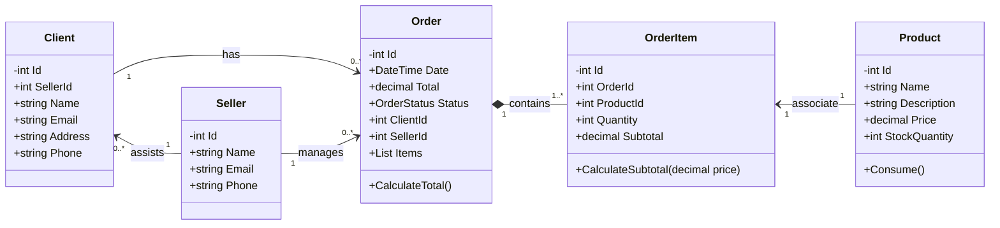
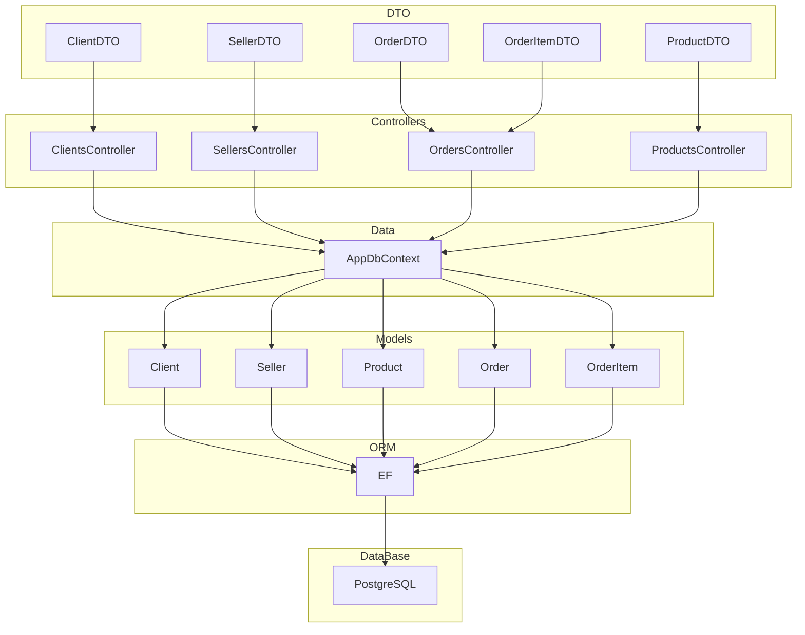

# Diagrama de classes

```mermaid
    classDiagram
        direction LR
        class Client {
            -int Id
            +int SellerId
            +string Name
            +string Email
            +string Address
            +string Phone
        }

        class Seller {
            -int Id
            +string Name
            +string Email
            +string Phone
        }

        class Product {
            -int Id
            +string Name
            +string Description
            +decimal Price
            +int StockQuantity
            +Consume()
        }

        class Order {
            -int Id
            +DateTime Date
            +decimal Total
            +OrderStatus Status
            +int ClientId
            +int SellerId
            +List<OrderItem> Items
            +CalculateTotal()
        }

        class OrderItem {
            -int Id
            +int OrderId
            +int ProductId
            +int Quantity
            +decimal Subtotal
            +CalculateSubtotal(decimal price)
        }
        Client "0..*" <-- "1" Seller : assists
        Client "1" --> "0..*" Order : has
        Seller "1" --> "0..*" Order : manages
        Order "1" *-- "1..*" OrderItem : contains
        OrderItem "1" <-- "1" Product : associate
```
# Arquitetura

```mermaid
    flowchart TB
        subgraph DTO
            DTO1[ClientDTO]
            DTO2[SellerDTO]
            DTO3[OrderDTO]
            DTO4[OrderItemDTO]
            DTO5[ProductDTO]
        end
        
        subgraph Controllers
            C1[ClientsController]
            C2[SellersController]
            C3[OrdersController]
            C4[ProductsController]
        end

        subgraph Models
            M1[Client]
            M2[Seller]
            M3[Product]
            M4[Order]
            M5[OrderItem]
        end

        subgraph Data
            D1[AppDbContext]
        end

        subgraph ORM
            ORM1[EF]
        end

        subgraph DataBase
            DB[PostgreSQL]
        end

            DTO1 --> C1
            DTO2 --> C2
            DTO3 --> C3
            DTO4 --> C3
            DTO5 --> C4
            
        C1 & C2 & C3 & C4 --> D1
        D1 --> M1 & M2 & M3 & M4 & M5

        M1 & M2 & M3 & M4 & M5 --> ORM1
        ORM1 --> DB
```